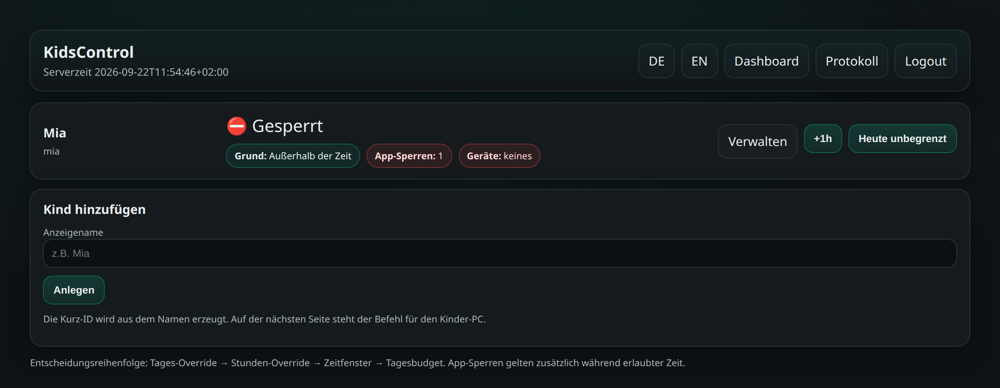
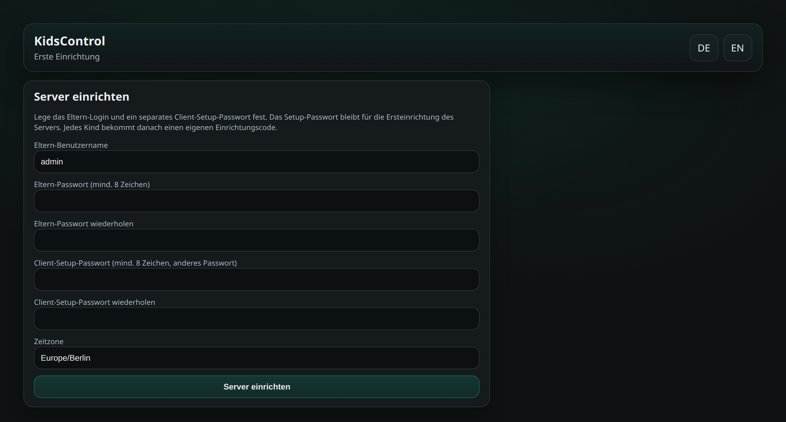
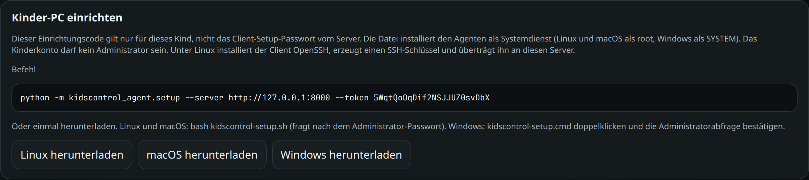
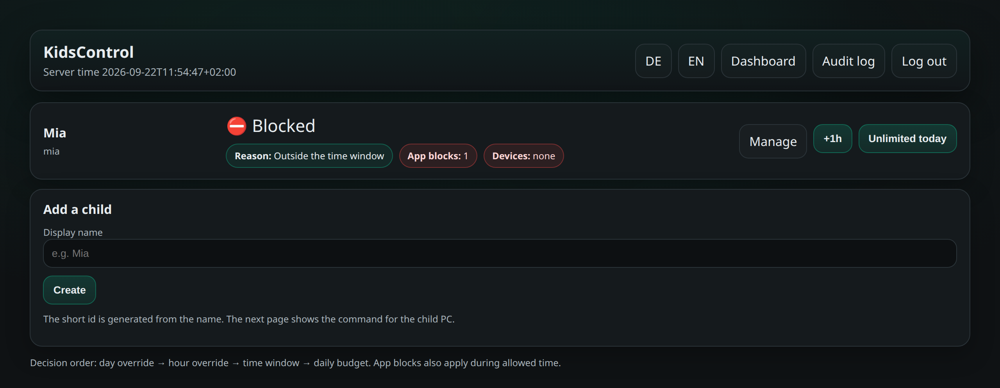
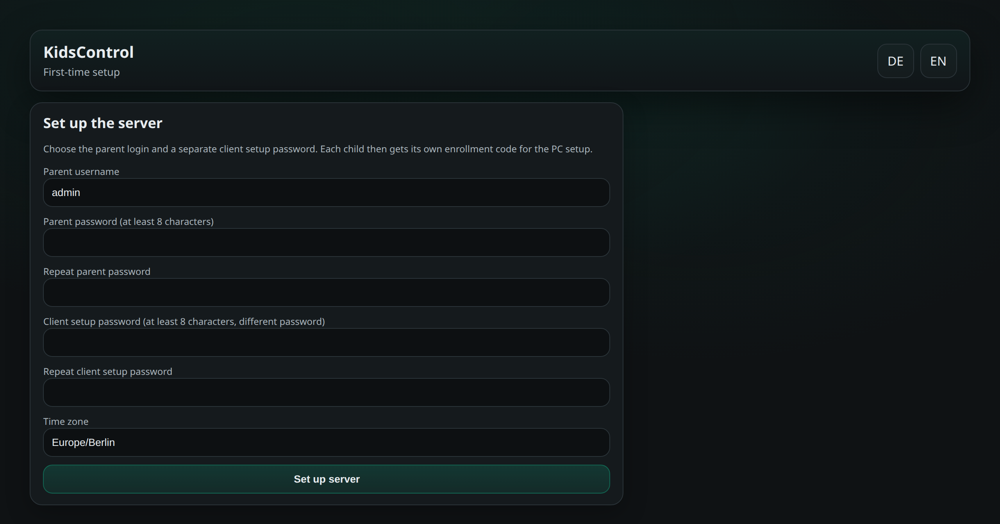
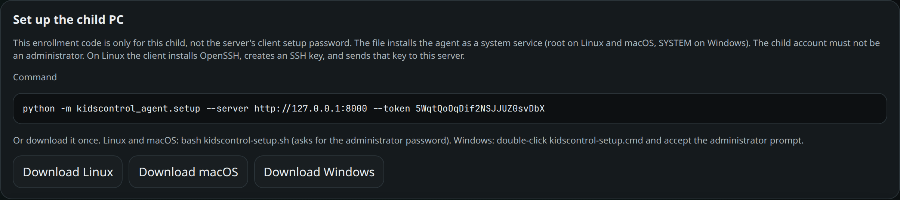

# KidsControl

Deutsch unten. English follows.

---

# Deutsch

**Zentraler Anlaufpunkt** für Eltern: Nutzungszeit der Kinder-PCs steuern und App-Aufrufe unterbinden – **unabhängig vom Betriebssystem** (Windows, macOS, Linux).

Die Web-Oberfläche gibt es auf Deutsch und Englisch (Schalter **DE / EN**).



## Was KidsControl macht

1. **Eltern-Hub (Server)** – Web-UI und API, einzige Quelle der Wahrheit
2. **Agent auf jedem Kinder-PC** – holt Regeln ab und setzt sie lokal durch
3. **Nutzungszeit** – Zeitfenster, Tagesminuten, +1h, „Heute unbegrenzt“
4. **App-Sperren** – Prozesse nach Muster beenden; jede Sperre ist danach änderbar
5. **Softwarestände und Updates** – Versionen melden, Updates über den Agenten oder per SSH

Keine Inhaltsanalyse, kein Keylogging, keine Bildschirmüberwachung.

## Systemvoraussetzungen

### Server (Eltern-Hub)

| | |
|---|---|
| Betriebssystem | Linux für den Dauerbetrieb (systemd). Windows 10/11 und macOS 12+ können den Hub ebenfalls starten. |
| Python | 3.10 oder neuer, mit `pip` und `venv` |
| Arbeitsspeicher | 256 MB frei reichen für einen Haushalt |
| Speicherplatz | etwa 500 MB inklusive virtueller Umgebung und SQLite-Datenbank |
| Netzwerk | ein freier TCP-Port (Standard **8000**), von den Kinder-PCs im LAN erreichbar |
| Browser | aktuelle Version von Firefox, Chrome, Edge oder Safari |

Nicht nötig: Active Directory, Docker, dieselbe Distribution auf allen Rechnern.

### Clients (Kinder-PCs)

| | Windows | macOS | Linux |
|---|---|---|---|
| Version | Windows 10 oder 11 | macOS 12 oder neuer | aktuelle Distribution mit systemd |
| Python | 3.10+ | 3.10+ | 3.10+ |
| Sitzung sperren | `LockWorkStation` | Bildschirmsperre über das System | `loginctl` oder Bildschirmschoner |
| Apps beenden | `taskkill` | `kill` | `kill` |
| OpenSSH | optional, Client vorhanden | eingebaut | wird beim Setup per apt, dnf oder pacman installiert (`openssh-server`) |
| Updates | optional `winget` | optional Homebrew | `apt`, `dnf` oder `pacman`; Updates brauchen passwortloses `sudo` |

## Einrichtung

Version **1.3.0**.

### 1. Server mit einem Klick

Linux und macOS: `./setup-server.sh` (macOS auch per Doppelklick auf `setup-server.command`). Windows: `setup-server.cmd` doppelklicken.

Das Skript legt die virtuelle Umgebung an, installiert die Abhängigkeiten, startet den Hub auf Port 8000 und öffnet den Browser. Beim ersten Start die Einrichtung im Browser abschließen (Eltern-Passwort und Client-Setup-Passwort). Danach den Prozess neu starten, damit `data/server.env` gilt.



Manuell, falls kein Doppelklick möglich ist:

```bash
python3 -m venv .venv
source .venv/bin/activate          # Windows: .venv\Scripts\activate
pip install -r requirements.txt
python -m app.setup
python -m uvicorn app.main:app --host 0.0.0.0 --port 8000
```

Die Datei `data/server.env` nicht ins Git legen.

Drei Geheimnisse, die nicht dasselbe sind:

- **Eltern-Passwort** – nur das Login in der Web-Oberfläche.
- **Client-Setup-Passwort** – einmal für den Server, ein Haus-Passwort. Es ist **nicht** der Code für den Kinder-PC. Du brauchst es nur als Notweg, wenn du `kidscontrol_agent.setup` ohne den Kind-Code startest (`--setup-password` und `--child`).
- **Einrichtungscode je Kind** – entsteht automatisch, wenn du ein Kind anlegst. Damit (Befehl oder One-Click-Download) richtest du den Kinder-PC ein.

Nach der Einrichtung nutzt der Agent nur noch den Geräte-Schlüssel in `client.env`. Weder Eltern-Passwort noch Client-Setup-Passwort noch der Kind-Code laufen im Alltag mit.

### 2. Kind und Client mit einem Klick

1. Anmelden und nur den Namen des Kindes eintragen.
2. Auf der Kind-Seite **Linux**, **macOS** oder **Windows** herunterladen. Server-Adresse und Einrichtungs-Code stecken in der Datei.
3. Auf dem Kinder-PC ausführen:
   - Linux und macOS: `bash kidscontrol-setup.sh` (macOS-Datei: `kidscontrol-setup.command`)
   - Windows: `kidscontrol-setup.cmd` doppelklicken



Das Skript installiert Python 3, falls es fehlt, lädt den Agenten vom Hub und richtet ihn als **Systemdienst** ein, nicht unter dem Kinderkonto. Linux und macOS fragen dafür nach dem Administrator-Passwort (`sudo`) und starten `kidscontrol-agent` als root. Windows legt eine Aufgabe an, die als `SYSTEM` startet. Das Kinderkonto darf kein Administrator sein, sonst kann es den Dienst beenden. OpenSSH kommt über apt, dnf oder pacman, der SSH-Schlüssel wird für root erzeugt und der private Teil an den Server übertragen. Danach steht das Gerät in der Eltern-UI.

Wer den Agenten schon im Ordner `client` hat, startet denselben Schritt als Administrator:

```bash
sudo python3 -m kidscontrol_agent.setup --server http://IP-DES-SERVERS:8000 --token CODE
```

## Dokumentation

- `docs/ARCHITECTURE.md`
- `docs/DATABASE.md`
- `docs/SERVER_SETUP.md`
- `docs/CLIENT.md`

## Lizenzierung

- Open Source: **GPL-3.0-or-later**
- Kommerzielle Lizenzen: **rolf_greger@web.de**

---

# English

**Central place** for parents to control screen time and block apps on children's PCs, **independent of the operating system** (Windows, macOS, Linux).

The web UI is available in German and English (switch **DE / EN**).



## What KidsControl does

1. **Parent hub (server)** – web UI and API, the only source of truth
2. **Agent on each child PC** – pulls the rules and enforces them locally
3. **Screen time** – weekly windows, daily minutes, +1h, “unlimited today”
4. **App blocks** – stop processes by pattern; each block can be edited later
5. **Software versions and updates** – report versions, update via the agent or over SSH

No content inspection, no keylogging, no screen surveillance.

## System requirements

### Server (parent hub)

| | |
|---|---|
| Operating system | Linux for an always-on hub (systemd). Windows 10/11 and macOS 12+ can run the hub as well. |
| Python | 3.10 or newer, with `pip` and `venv` |
| Memory | 256 MB free is enough for a household |
| Disk | about 500 MB including the virtualenv and the SQLite database |
| Network | one free TCP port (default **8000**) reachable from the child PCs on the LAN |
| Browser | a current Firefox, Chrome, Edge, or Safari |

Not required: Active Directory, Docker, or the same distribution on every machine.

### Clients (child PCs)

| | Windows | macOS | Linux |
|---|---|---|---|
| Version | Windows 10 or 11 | macOS 12 or newer | a current distribution with systemd |
| Python | 3.10+ | 3.10+ | 3.10+ |
| Lock session | `LockWorkStation` | system screen lock | `loginctl` or a screensaver |
| Stop apps | `taskkill` | `kill` | `kill` |
| OpenSSH | optional; the client is usually present | built in | installed during setup by apt, dnf, or pacman (`openssh-server`) |
| Updates | optional `winget` | optional Homebrew | `apt`, `dnf`, or `pacman`; updates need passwordless `sudo` |

## Setup

Version **1.3.0**.

### 1. One-click server

Linux and macOS: `./setup-server.sh` (on macOS, double-click `setup-server.command` as well). Windows: double-click `setup-server.cmd`.

The script creates the virtualenv, installs dependencies, starts the hub on port 8000, and opens a browser. On the first start, finish setup in the browser (parent password and client setup password). Restart the process afterwards so `data/server.env` is picked up.



Manual start, if a double-click is not possible:

```bash
python3 -m venv .venv
source .venv/bin/activate          # Windows: .venv\Scripts\activate
pip install -r requirements.txt
python -m app.setup
python -m uvicorn app.main:app --host 0.0.0.0 --port 8000
```

Do not commit `data/server.env`.

Three secrets that are not the same thing:

- **Parent password** – only the login for the web UI.
- **Client setup password** – set once for the server, a household password. It is **not** the code for the child PC. You need it only as a fallback if you run `kidscontrol_agent.setup` without the child code (`--setup-password` and `--child`).
- **Enrollment code per child** – created automatically when you add a child. That is what you use (command or one-click download) to set up the child PC.

After enrollment the agent only uses the device key in `client.env`. Neither the parent password, nor the client setup password, nor the child code is used in daily operation.

### 2. One-click child and client

1. Sign in and enter only the child's name.
2. On the child page, download **Linux**, **macOS**, or **Windows**. The file already contains the server address and the enrollment code.
3. On the child PC:
   - Linux and macOS: `bash kidscontrol-setup.sh` (macOS file: `kidscontrol-setup.command`)
   - Windows: double-click `kidscontrol-setup.cmd`



The script installs Python 3 when it is missing, downloads the agent from the hub, and installs it as a **system service**, not as the child account. Linux and macOS ask for the administrator password (`sudo`) and start `kidscontrol-agent` as root. Windows creates a task that runs as `SYSTEM`. The child account must not be an administrator, or the child can stop the service. OpenSSH is installed with apt, dnf, or pacman; the SSH key is created for root and the private key is sent to the server. The device then shows up in the parent UI.

If the agent is already in the `client` folder, start the same step as administrator:

```bash
sudo python3 -m kidscontrol_agent.setup --server http://SERVER-IP:8000 --token CODE
```

## Documentation

- `docs/ARCHITECTURE.md`
- `docs/DATABASE.md`
- `docs/SERVER_SETUP.md`
- `docs/CLIENT.md`

## Licensing

- Open source: **GPL-3.0-or-later**
- Commercial licenses: **rolf_greger@web.de**
